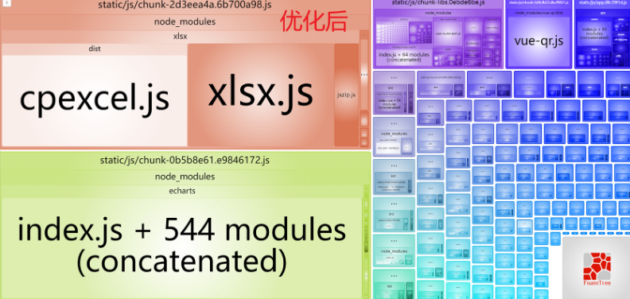

## 项目优化

#### 打包前


#### 使用 Vue 自带的 分析包 命令

```javascript
"report": "vue-cli-service build --report"
```


这里可以看出 ElementUI 是一个比较的文件，我们可以先从这里开始

### 使用

```html
<link
  rel="stylesheet"
  href="https://cdn.jsdelivr.net/npm/element-ui/lib/theme-chalk/index.css"
/>

<script src="https://cdn.jsdelivr.net/npm/vue/dist/vue.js"></script>
<script src="https://cdn.jsdelivr.net/npm/element-ui/lib/index.js"></script>
```

### 优化过后，因为最初的目的是减轻打包体积，减轻服务器压力，这就使得在不同网速中会出现偏差，在公司测试的时候，大概在2-3秒左右，在宿舍测试为10-7秒左右





#### 相关链接

[CDN 网站](https://www.jsdelivr.com/)
